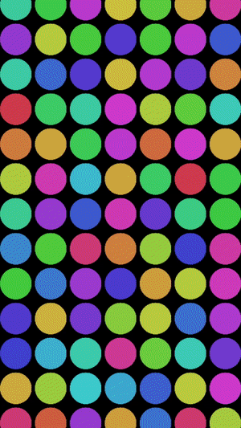

# RippleEffectView
Not only Uber-like animated screen background.

[](https://developer.apple.com/swift/)
[](http://cocoapods.org/pods/RippleEffectView)
[](http://twitter.com/alsedi)
[](http://blog.alsedi.com)

RippleEffectView inspired by RayWenderlich.com article [How To Create an Uber Splash Screen](https://www.raywenderlich.com/133224/how-to-create-an-uber-splash-screen)

## How it may looks like 
### Basic customization (color randomization)
``` swift
rippleEffectView.tileImageRandomizationClosure = { rows, columns, row, column, image in
  let newImage = image.imageWithRenderingMode(UIImageRenderingMode.AlwaysTemplate)
  UIGraphicsBeginImageContextWithOptions(image.size, false, newImage.scale)
  UIColor.random.set()
  newImage.drawInRect(CGRectMake(0, 0, image.size.width, newImage.size.height));
  if let titledImage = UIGraphicsGetImageFromCurrentImageContext() {
    UIGraphicsEndImageContext()
    return titledImage
  }
  UIGraphicsEndImageContext()
  return image
}
```
``` swift 
rippleEffectView.magnitude = -0.6
```


``` swift 
rippleEffectView.magnitude = 0.2
```


### Complex customization
``` swift
rippleEffectView.tileImageCustomizationClosure = { rows, columns, row, column, image in
  let newImage = image.imageWithRenderingMode(UIImageRenderingMode.AlwaysTemplate)
  UIGraphicsBeginImageContextWithOptions(image.size, false, newImage.scale)
      
  let xmiddle = (columns % 2 != 0) ? columns/2 : columns/2 + 1
  let ymiddle = (rows % 2 != 0) ? rows/2 : rows/2 + 1
      
  let xoffset = abs(xmiddle - column)
  let yoffset = abs(ymiddle - row)
      
  UIColor(hue: 206/360.0, saturation: 1, brightness: 0.95, alpha: 1).colorWithAlphaComponent(1.0 - CGFloat((xoffset + yoffset)) * 0.1).set()
      
  newImage.drawInRect(CGRectMake(0, 0, image.size.width, newImage.size.height));
  if let titledImage = UIGraphicsGetImageFromCurrentImageContext() {
    UIGraphicsEndImageContext()
    return titledImage
  }
  UIGraphicsEndImageContext()
  return image
}
```
``` swift
rippleEffectView.rippleType = .Heartbeat
rippleEffectView.magnitude = 0.2
```


## Requirements
- Swift 3.0+
- iOS 9.3+
- Xcode 8.0+

# Installation

## CocoaPods
RippleEffectView is available through [CocoaPods](http://cocoapods.org/pods/RippleEffectView). To install
it, simply add the following line to your Podfile:

```ruby
target 'Your Project' do
	use_frameworks!
	pod "RippleEffectView"
end
```

### Manual
Copy `RippleEffectView.swift`to your project, then 

#Usage
Add new RippleEffectView, assign `tileImage` and call `startAnimating()`.
``` swift
let rippleEffectView = RippleEffectView()
rippleEffectView.image = UIImage(imageNamed: "someImage") 
rippleEffectView.animationDuration = 4
rippleEffectView.magnitude = 0.3
view.addSubview(rippleEffectView)
rippleEffectView.startAnimating()
```
NB! startAnimating doesn't work if called in viewDidLoad and viewWillAppear. Working on fix. Place `startAnimating()` in `viewDidAppear()`

## Configurable properties
NB! RippleEffectView initialize itself with parent view bounds automatically, so you do not need to set it manually. If you need to use it in limited view, then use auxiliary view, e.g.

Animation uses `transform`, `scale` and `opacity`. 

### Special properties
1. `tileImage` UIImage that will displayed in every title. RippleEffectView uses size of image to calculate grid size. No default value.
2. `animationDuraton`. Default `3.5`
3. `magnitude` force that will be applied to every circle to create ripple effect. Uber-like effect is about `0.1` - `0.2`. GIF example `-0.8`
4. `cellSize` size of tile. Could be helpful if vector image used. Property is optional, if not set then tileImage size will be used.
5. `rippleType` Type of ripple effect. `.OneWave` and `.Heartbeat`. Default `.OneWave`

##Read-only properties
1. `rows` rows count
2. `columns` columns count

## Methods
`stopAnimating` Start ripple animation
`startAnimating` Stop all animations

### Manual control of the grid.
You will need this if you change `tileImageRandomizationClosure`. When you call `renderGrid` to recreate all items.
If you want just remove all items (e.g. memory warning) then call `removeGrid`

## Callbacks
### Tile image customization.

You may setup image for each grid view individually, or customize one that assigned in `tileImage`. (See Demo project for example code)
``` swift
var tileImageRandomizationClosure: RandomizationClosure? = (totalRows:Int, totalColumns:Int, currentRow:Int, currentColumn:Int, originalImage:UIImage)->(UIImage)
```

### Animation Finished
Main purpose of this component is to create animated screen background. You may stop animation and hide a screen as soon as data available, or wait for the animation end and the show the data.
``` swift
rippleEffectView.animationDidStop = { _ in 
  // do something
}
```
